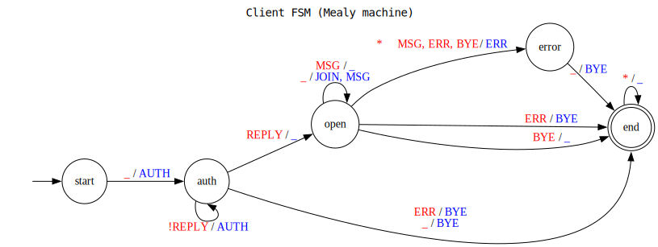
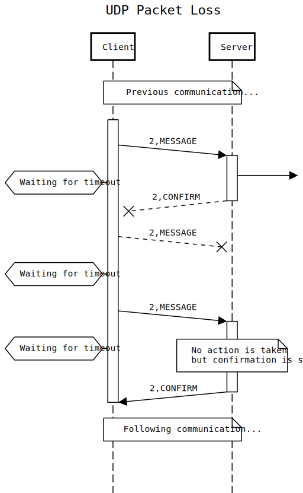
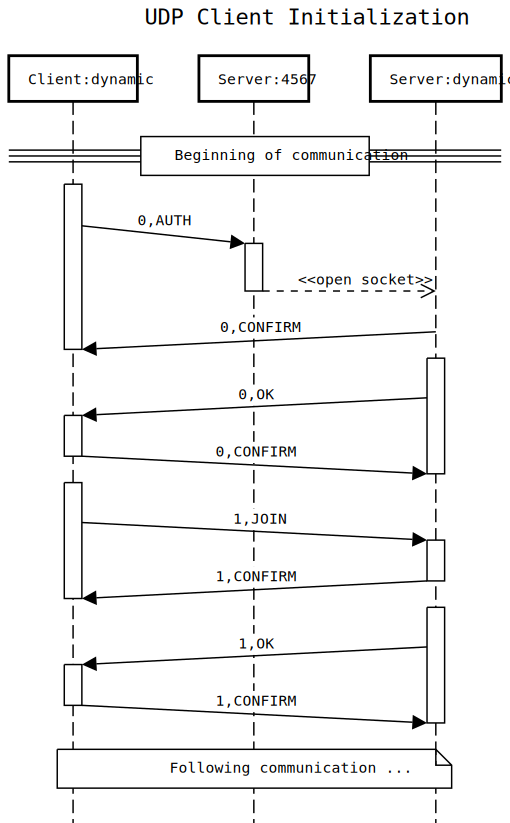
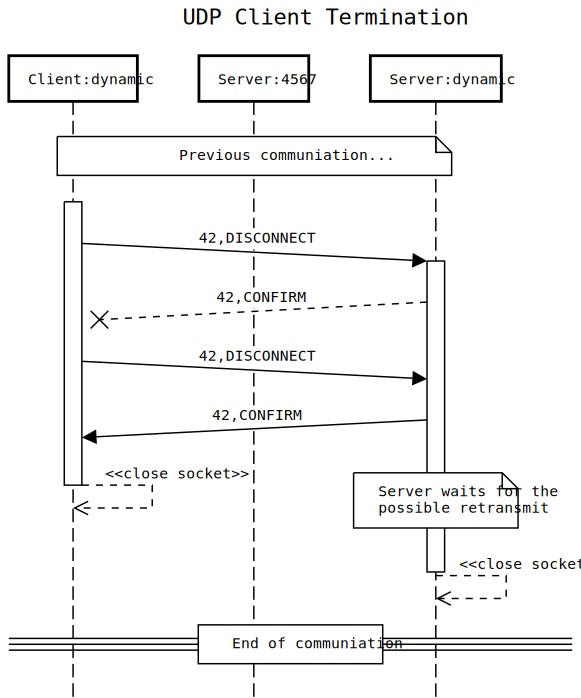

# IPK Project 1: Client for a chat server using `IPK24-CHAT` protocol

>  The key words "MUST", "MUST NOT", "REQUIRED", "SHALL", "SHALL NOT", "SHOULD", "SHOULD NOT", "RECOMMENDED",  "MAY", and "OPTIONAL" in this document are to be interpreted as described in RFC 2119 [RFC2119].

This project's task is to design and implement a client application, which is able to communicate with a remote server using the `IPK24-CHAT` protocol.
The protocol has got two variants - each built on top of a different transport protocol.
**You are required to implement both variants.**
Please focus on the networking aspects of this project as much as possible.

## Table of Contents

- [IPK Project 1: Client for a chat server using `IPK24-CHAT` protocol](#ipk-project-1-client-for-a-chat-server-using-ipk24-chat-protocol)
  - [Table of Contents](#table-of-contents)
  - [Specification](#specification)
    - [UDP variant](#udp-variant)
      - [Solving Transport Protocol Issues](#solving-transport-protocol-issues)
      - [Message Header](#message-header)
        - [Message `Type`](#message-type)
        - [`MessageID`](#messageid)
      - [Message contents](#message-contents)
        - [`CONFIRM`](#confirm)
        - [`REPLY`](#reply)
        - [`AUTH`](#auth)
        - [`JOIN`](#join)
        - [`MSG`](#msg)
        - [`ERR`](#err)
        - [`BYE`](#bye)
      - [UDP transport summarized](#udp-transport-summarized)
    - [TCP variant](#tcp-variant)
      - [Message Grammar](#message-grammar)
      - [Message Content Type Mapping](#message-content-type-mapping)
  - [Program Execution](#program-execution)
    - [CLI arguments](#cli-arguments)
    - [Client behaviour, input and commands](#client-behaviour-input-and-commands)
    - [Client output](#client-output)
  - [Functionality Illustration](#functionality-illustration)
    - [Reference Resources](#reference-resources)
      - [Using Public Reference Server](#using-public-reference-server)
      - [Using Wireshark Protocol Dissector](#using-wireshark-protocol-dissector)
      - [Using netcat](#using-netcat)
        - [UDP](#udp)
        - [TCP](#tcp)
      - [Using tcpdump](#using-tcpdump)
    - [Client input/output](#client-inputoutput)
    - [Network Transport](#network-transport)
      - [Using Captured PCAPs](#using-captured-pcaps)
      - [UDP](#udp-1)
      - [TCP](#tcp-1)
  - [Submission](#submission)
  - [Evaluation](#evaluation)
  - [Contributing](#contributing)
  - [Bibliography](#bibliography)

## Specification
The `IPK24-CHAT` protocol defines a high-level behaviour, which can then be implemented on top of one of the well known transport protocols such as TCP [RFC9293] or UDP [RFC768].
Each of these options comes with its own challenges.
As for the network layer protocol requirements, only IPv4 must be supported by your implementation.

| Protocol property       | Value
| ----------------------- | -----
| Default server port     | `4567`
| Network protocols       | `IPv4`
| Transport protocols     | `TCP` and `UDP`
| Supported charset       | `us-ascii`

The protocol defines the following message types to correctly represent the behaviour of each party communicating with this protocol:

| Type name | Description
| --------- | -----------
| `ERR`     | Indicates that an error has occured while processing the other party's last message, this eventually results in the termination of the communication
| `CONFIRM` | Only leveraged in certain protocol variants (UDP) to explicitly confirm the successful delivery of the message to the other party on the application level
| `REPLY`   | Some messages (requests) require a positive/negative confirmation from the other side, this message contains such data
| `AUTH`    | Used for client authentication (signing in) using user-provided username, display name and a password
| `JOIN`    | Represents client's request to join a chat channel by its identifier
| `MSG`     | Contains user display name and a message designated for the channel they're joined in
| `BYE`     | Either party can send this message to indicate that the conversation/connection is to be terminated. This is the final message sent in a conversation (except its potential confirmations in UDP)

Client's behaviour can be described by the following Mealy machine (a finite state machine).
<span style="color:red">Red values</span> indicate server-sent messages (input) to the client.
<span style="color:blue">Blue values</span> correspond to the client-sent messages (output) to the server.
There are few important notes as for the schema interpretation:

- the underscore (`_`) value represents *no message* (e.g., no input is received, no output is sent),
- the star (`*`) value represents *all possible messages* (e.g., any input is received),
- when multiple values are specified on the input/output positions they are to be interpreted as "any one of",
- `REPLY` and `!REPLY` correspond to the same message type, the exclamation mark (`!`) represents a negative version of the reply,
- receiving any server message other than any of the accepted by the corresponding state results in a transition to the `error` state, output of the error message (same way as shown in the `open -> error` transition) and continuation from the FSM `error` state - these transitions were omitted from the diagram for the purposes of clarity.



By inspecting the client state machine you can notice that no `JOIN` message is necessary after successful authentication - the server is required to immediatelly join you in a default channel.
`JOIN` is then used only when changing channels.

The following table shows the mandatory parameters of given message types.
Their names (identifiers) will be used further in the document to signify placement of their values in the protocol messages.

| FMS name | Mandatory message parameters
| -------- | ----------------------------
| `AUTH`   | `Username`, `DisplayName`, `Secret`
| `JOIN`   | `ChannelID`, `DisplayName`
| `ERR`    | `DisplayName`, `MessageContent`
| `BYE`    | *N/A*
| `MSG`    | `DisplayName`, `MessageContent`
| `REPLY`  | `true`, `MessageContent`
| `!REPLY` | `false`, `MessageContent`

The values for the message contents defined above will be extracted from the provided user input.
Handling user-provided input is discussed at a [later point](#client-behaviour-input-and-commands).

| Message parameter | Max. length | Characters
| ----------------- | ----------- | ----------
| `MessageID`       | `uint16`    | *N/A*
| `Username`        | `20`        | `A-z0-9-` (e.g., `Abc-23`)
| `ChannelID`       | `20`        | `A-z0-9-` (e.g., `Abc-23`)
| `Secret`          | `128`       | `A-z0-9-` (e.g., `Abc-23`)
| `DisplayName`     | `20`        | *Printable characters* (`0x21-7E`)
| `MessageContent`  | `1400`      | *Printable characters with space* (`0x20-7E`)

These parameter identifiers will be used in the sections to follow to denote their locations within the protocol messages or program output.
The notation with braces (`{}`) is used for required parameters, e.g., `{Username}`.
Optional parameters are specified in square brackets (`[]`).
Both braces and brackets must not be a part of the resulting string after the interpolation.

Based on the parameter content limitations defined above, there should never be an issue with IP [RFC791] fragmentation caused by exceeding the default Ethernet MTU of `1500` octets as defined by [RFC894]. 

### UDP variant
The first variant of the `IPK24-CHAT` protocol is built on top of UDP [RFC768].
As the UDP is connection-less and the delivery is unreliable, using it as a transport layer protocol poses certain challenges which need to be addressed at the application layer.
These challenges include but are not limited to datagram loss, duplication and reordering.

The diagram below shows the order of protocol headers sent in the beginning of each protocol message.
```
+----------------+------------+------------+--------------+
|  Local Medium  |     IP     |     UDP    |  IPK24-CHAT  |
+----------------+------------+------------+--------------+
```

The following snippet shows what the UDP header looks like.
```
 0                   1                   2                   3
 0 1 2 3 4 5 6 7 8 9 0 1 2 3 4 5 6 7 8 9 0 1 2 3 4 5 6 7 8 9 0 1
+---------------+---------------+---------------+---------------+
|          Source Port          |       Destination Port        |
+---------------+---------------+---------------+---------------+
|            Length             |           Checksum            |
+---------------+---------------+---------------+---------------+
```

The protocol leverages dynamic port allocation to separate communication with each client after the initial message is received.
This simplifies identification and client message handling on the server side and does not particularly complicate things for the client.
After the initial message (`AUTH`) is sent to the server, client must anticipate the response to originate from a different transport protocol source port.

The equivalent behaviour is also used by other protocols, such as TFTP [RFC1350] (you can read details about this mechanism in [section 4 of the RFC](https://datatracker.ietf.org/doc/html/rfc1350#autoid-4)).
Behaviour described above can be seen in the snippet below.
The `dyn1` and `dyn2` values represent the dynamic ports assigned when binding the sockets.
You can disregard the message contents, the aim is to illustrate the port switching mechanism.

```
  port | client                                          server | port  | type
-------+--------------------------------------------------------+-------+-------
 :dyn1 | |2|0|username|0|Nick Name|0|Secret|0|  -->             | :4567 | AUTH
 :dyn1 |                                             <--  |0|0| | :dyn2 | CONFIRM
 :dyn1 |                   <--  |1|0|1|Authentication success.| | :dyn2 | REPLY
 :dyn1 | |0|0|  -->                                             | :dyn2 | CONFIRM
```

> Food for thought: Can you identify what kind of security issues are there for this protocol, in case the dynamic server port is used as the sole identifier of user connection?

#### Solving Transport Protocol Issues
Since the message delivery is inherently unreliable it is necessary to handle message transport issues on the application level.

**Packet loss** can be detected using mandatory message confirmation with timeouts.
Once a message is sent it is required to confirm its successful delivery by the other party.
The confirmation should be sent immediately after receiving the message, regardless of any potential higher-level processing issues - unless the connection has already been successfully terminated, in such a case it is valid not to respond to the message at all.
When the confirmation is not received by the original sender within a given timespan, the message is considered lost in transit.
Messages lost in transit are re-transmitted until the confirmation is successfully received or an internal re-try condition is triggered.
Only the original message sender performs message retransmit, not receiver (confirmation messages are never re-transmitted or explicitly confirmed).

| Variable             | Recommended value | Notes
| -------------------- | ----------------: | -----
| Confirmation timeout | `250ms`           | *N/A*
| Retry count          | `3`               | 1 initial + 3 retries

**Packet delay/duplication** can be detected by keeping track of processed unique message IDs.
Once a message is received it is compared to a list of already seen message IDs.
Afterwards, there are two options:
either the message ID was not previously seen (the message is then processed normally),
or the message ID is contained within the list, meaning it has already been processed.
In case of the latter, only the confirmation of delivery is sent to the message sender.
No additional action is taken otherwise.

The transport protocol issues and their solutions described above can be seen visualised in the following diagrams.
| Packet loss                        | Packet delay/duplication
| :--------------------------------: | :----------------------------------:
|  | 

> Food for thought: What would be the maximum message size for this protocol variant?

> Food for thought: What would happen on the network layer if the specification would allow messages of such size?

#### Message Header
The following snippet presents the general structure of any application message sent via this protocol variant.
You can notice that there is a uniform header of 3 bytes, which will be present in the beginning of each message (both sent and received).
There are two distinct fields `Type` and `MessageID` (more details are available in the table below the snippet).
The fields comprise of 1B for the message type and 2B for the message ID.
The content that follows is variable in length and depends on the message type.
Some messages may not have any additional content at all.
```
 0      7 8     15 16    23 24
+--------+--------+--------+---~~---+
|  Type  |    MessageID    |  ....  |
+--------+--------+--------+---~~---+
```

| Field name  | Value     | Notes
| :---------- | --------: | -----
| `Type`      | `uint8`   | *N/A*
| `MessageID` | `uint16`  | Sent in network byte order

##### Message `Type`
The table below shows the mapping of the protocol message types (as defined in the [Specification section](#specification)), the first field (`Type`) of the application datagram header for this protocol variant.
This unique number is used to identify which message has been received.
| Message type | Field value   
| ------------ | -----------
| `CONFIRM`    | `0x00` 
| `REPLY`      | `0x01` 
| `AUTH`       | `0x02` 
| `JOIN`       | `0x03` 
| `MSG`        | `0x04` 
| `ERR`        | `0xFE` 
| `BYE`        | `0xFF` 

##### `MessageID`
Message ID is a 2 byte number for a unique identifiation of a particular message.
The value must never appear as a message identifier of a different message in the communication once it has been used.
Each side in the communication has its own identifier sequence.
The easiest and recommended implementation is to use values starting from `0`, simply incremented by `1` for each message _sent_ (**not received**).

#### Message contents
This section describes the messages used in this protocol version.
The following snippets describe different ways of message field description.

This snippet shows two fields, one byte each:
```
+--------+---+
|  0x00  | 0 |
+--------+---+
```

This snippet represents variable length data field terminated by a zero byte:
```
+----------~~----------+---+
| Variable length data | 0 |
+----------~~----------+---+
```

The particular message type specifications follow based on the previous snippets.

##### `CONFIRM`
```
  1 byte       2 bytes      
+--------+--------+--------+
|  0x00  |  Ref_MessageID  |
+--------+--------+--------+
```

| Field name      | Value     | Notes
| :-------------- | --------: | -----
| `Ref_MessageID` | `uint16`  | The `MessageID` value of the message being confirmed

##### `REPLY`
```
  1 byte       2 bytes       1 byte       2 bytes      
+--------+--------+--------+--------+--------+--------+--------~~---------+---+
|  0x01  |    MessageID    | Result |  Ref_MessageID  |  MessageContents  | 0 |
+--------+--------+--------+--------+--------+--------+--------~~---------+---+
```

| Field name        | Value      | Notes
| :---------------- | ---------: | -----
| `Result`          | `0` or `1` | `0` indicates failure, `1` indicates success
| `Ref_MessageID`   | `uint16`   | The `MessageID` value of the message replying to
| `MessageContents` | `string`   | Only contains non-`0` bytes (further conforms to rules set in the [protocol Specification](#specification)), is always followed by a zero byte

##### `AUTH`
```
  1 byte       2 bytes      
+--------+--------+--------+-----~~-----+---+-------~~------+---+----~~----+---+
|  0x02  |    MessageID    |  Username  | 0 |  DisplayName  | 0 |  Secret  | 0 |
+--------+--------+--------+-----~~-----+---+-------~~------+---+----~~----+---+
```

| Field name    | Value    | Notes
| :------------ | -------: | -----
| `Username`    | `string` | Only contains non-`0` bytes (further conforms to rules set in the [protocol Specification](#specification)), is always followed by a zero byte
| `DisplayName` | `string` | Only contains non-`0` bytes (further conforms to rules set in the [protocol Specification](#specification)), is always followed by a zero byte
| `Secret`      | `string` | Only contains non-`0` bytes (further conforms to rules set in the [protocol Specification](#specification)), is always followed by a zero byte

##### `JOIN`
```
  1 byte       2 bytes      
+--------+--------+--------+-----~~-----+---+-------~~------+---+
|  0x03  |    MessageID    |  ChannelID | 0 |  DisplayName  | 0 |
+--------+--------+--------+-----~~-----+---+-------~~------+---+
```

| Field name    | Value    | Notes
| :------------ | -------: | -----
| `ChannelID`   | `string` | Only contains non-`0` bytes (further conforms to rules set in the [protocol Specification](#specification)), is always followed by a zero byte
| `DisplayName` | `string` | Only contains non-`0` bytes (further conforms to rules set in the [protocol Specification](#specification)), is always followed by a zero byte

##### `MSG`
```
  1 byte       2 bytes      
+--------+--------+--------+-------~~------+---+--------~~---------+---+
|  0x04  |    MessageID    |  DisplayName  | 0 |  MessageContents  | 0 |
+--------+--------+--------+-------~~------+---+--------~~---------+---+
```

| Field name        | Value    | Notes
| :---------------- | -------: | -----
| `DisplayName`     | `string` | Only contains non-`0` bytes (further conforms to rules set in the [protocol Specification](#specification)), is always followed by a zero byte
| `MessageContents` | `string` | Only contains non-`0` bytes (further conforms to rules set in the [protocol Specification](#specification)), is always followed by a zero byte

##### `ERR`
```
  1 byte       2 bytes
+--------+--------+--------+-------~~------+---+--------~~---------+---+
|  0xFE  |    MessageID    |  DisplayName  | 0 |  MessageContents  | 0 |
+--------+--------+--------+-------~~------+---+--------~~---------+---+
```

The structure is identical to the `MSG` message.

##### `BYE`
```
  1 byte       2 bytes      
+--------+--------+--------+
|  0xFF  |    MessageID    |
+--------+--------+--------+
```


#### UDP transport summarized

The following diagrams show the behaviour of the protocol in different transport conditions as previously described.
| Session initialization                    | Packet loss                        | Packet delay/duplication             | Session termination                        |
| :---------------------------------------: | :--------------------------------: | :----------------------------------: | :----------------------------------------: |
|  |  |  |  |

### TCP variant
The second variant of the `IPK24-CHAT` protocol is built on top of TCP [RFC9293].
Given the properties of this transport protocol (connection-oriented with reliable delivery), there is little to worry about on the application layer.
This protocol variant is entirely textual; hence, it uses text-based commands to communicate with the remote server in all cases.
The connection to the server is stateful and is required to respect the same client state behaviour as described in the general protocol section above.

> <span style="color:orange">Graceful connection termination does not involve TCP messages with `RST` flag set by either communicating party.
</span>

#### Message Grammar
The following ABNF [RFC5234] grammar snippet describes the forming of valid messages for this version of the application protocol.
Refer to the notation specification for information on interpreting the grammar syntax and semantics.
**Read the grammar specification carefully**, full and correct understanding of the notation *will* be tested.
It is imperative that you can reliably interpret the real meaning of the formal definition.

```abnf
; core content components
ID        = 1*20   ( ALPHA / DIGIT / "-" )
SECRET    = 1*128  ( ALPHA / DIGIT / "-" )
CONTENT   = 1*1400 ( VCHAR / SP )
DNAME     = 1*20   VCHAR

; additional content components
is     = SP "IS"    SP
as     = SP "AS"    SP
using  = SP "USING" SP

; message content variant parts
contentJoin     = "JOIN"       SP ID    as DNAME
contentAuth     = "AUTH"       SP ID    as DNAME using SECRET
contentMessage  = "MSG FROM"   SP DNAME is CONTENT
contentError    = "ERROR FROM" SP DNAME is CONTENT
;
contentReply    = "REPLY" ( "OK" / "NOK" ) is CONTENT
contentBye      = "BYE"

; message content variants
content  =  contentAuth
content  =/ contentJoin
content  =/ contentMessage
content  =/ contentError
content  =/ contentReply
content  =/ contentBye

; each message is is either variant terminated with "\r\n"
message = content CRLF
```

Contents of each message sent and received in this protocol variant must conform to the `message` rule from the grammar above.

#### Message Content Type Mapping
The following table shows a mapping of message keywords, used in `content*` rules of the content grammar above, to the message types available in the `IPK24-CHAT` protocol (as defined in the [Specification section](#specification)).
Note that the message of type `CONFIRM` is unused in this protocol version as it is unnecessary as opposed to the UDP variant.
This is due to the fact the selected transport layer protocol ensures correct application data delivery for us.

| Message type | Message template
| ------------ | ----------------
| `ERROR`      | `ERROR FROM {DisplayName} IS {MessageContent}\r\n`
| `REPLY`      | `REPLY IS {MessageContent}\r\n`
| `AUTH`       | `AUTH {Username} USING {Secret}\r\n`
| `JOIN`       | `JOIN {ChannelID} AS {DisplayName}\r\n`
| `MSG`        | `MSG FROM {DisplayName} IS {MessageContent}\r\n`
| `BYE`        | `BYE\r\n`
| `CONFIRM`    | Unused in TCP

Keep in mind that values for variables in the templates defined above further conform to rules defined by the [message grammar](#message-grammar).

> Food for thought: Why is the message termination string `\r\n` necessary?
> How does it compare to processing messages sent over the UDP?

## Program Execution
This section defines the required behaviour and interface of the implemented client application on program execution level.

### CLI arguments
The implemented program must support and respect command line arguments as defined in the table below.
It is required to have corresponding program subsystems parameterisable by these values at minimum.

| Argument | Value                                           | Possible values        | Meaning or expected program behaviour
| -------- | ----------------------------------------------- | ---------------------- | -------------------------------------
| `-t`     | <span style="color:orange">User provided</span> | `tcp` or `udp`         | Transport protocol used for connection
| `-s`     | <span style="color:orange">User provided</span> | IP address or hostname | Server IP or hostname
| `-p`     | `4567`                                          | `uint16`               | Server port
| `-d`     | `250`                                           | `uint16`               | UDP confirmation timeout
| `-r`     | `3`                                             | `uint8`                | Maximum number of UDP retransmissions
| `-h`     |                                                 |                        | Prints program help output and exits

> <span style="color:orange">Edge cases of argument processing will not be a part of evaluation (e.g., providing argument more than once, providing invalid argument value, providing unknown arguments).
Application behaviour is expected to be undefined in such cases.
</span>

Arguments with "<span style="color:orange">User provided</span>" text in the value column are mandatory and have to be always specified when running the program.
Other values indicate the argument is optional with its default value defined in the column (or no value at all).

> <span style="color:deepskyblue">Your program may support more command line arguments than defined above.
Make sure there is no name or behaviour clash between the required arguments and the custom ones.
</span>

### Client behaviour, input and commands
Any user-provided data from the standard program input stream (`stdin`) are to be intepreted either as a local command or a text message to be sent to the remote server.
Each user chat message or a local client command invocation is terminated by a new line character (`\n`).
All valid commands must be prefixed with a forward slash character (`/`) and immediatelly followed by non-zero number of `A-z0-9-_` characters uniquely identifying the command.
The client must support the following client commands:

| Command     | Parameters                              | Client behaviour
| ----------- | --------------------------------------- | ----------------
| `/auth`     | `{Username}` `{Secret}` `{DisplayName}` | Sends `AUTH` message with the data provided from the command to the server (and correctly handles the `Reply` message), locally sets the `DisplayName` value (same as the `/rename` command)
| `/join`     | `{ChannelID}`                           | Sends `JOIN` message with channel name from the command to the server (and correctly handles the `Reply` message)
| `/rename`   | `{DisplayName}`                         | Locally changes the display name of the user to be sent with new messages/selected commands
| `/help`     |                                         | Prints out supported local commands with their parameters and a description

Please note that order of the command parameters must stay stay the same as shown in the definitions above.

> <span style="color:deepskyblue">Your program may support more local client commands than defined above.
Make sure there is no name or behaviour clash between the required commands and the custom ones.
</span>

User input not prefixed with the proper command character shall be interpreted as a message to be sent to the server.
In case the provided user input is unacceptable at the current client state, the application must inform the user about such situation (by printing out a useful error message).
The application must not terminate in such a case.
This includes for example:
- trying to send a message in non-`open` state,
- trying to join a channel in non-`open` state,
- trying to process an unknown or otherwise malformed command.

The client must also react to the *Interrupt* signal (`C-c`) by gracefully exiting and cleanly terminating the connection as appropriate for the selected protocol variant (confirmed `BYE` message for UDP, no `RST` flags in case of TCP).
The equivalent client behaviour can be achieved by reaching the end of user input or receiving a `BYE` message from the server.

### Client output
The contents of an incomming `MSG` message are required to be printed to standard output stream (`stdout`) and formatted as follows:
```
{DisplayName}: {MessageContent}\n
```

The contents of an incomming `ERR` message are required to be printed to standard error stream (`stderr`) and formatted as follows:
```
ERROR FROM {DisplayName}: {MessageContent}\n
```

Internal client application errors are required to be printed to standard error stream (`stderr`) and formatted as follows:
```
ERROR: {MessageContent}\n
```

The contents of an incomming `REPLY` message are required to be printed to standard error stream (`stderr`) and formatted as follows (there are two variants of the reply message):
```
Success: {Reason}\n
```
```
Failure: {Reason}\n
```

No application message other than the types specified above should trigger any program output.

> <span style="color:deepskyblue">You may customize the default message format as much as you like (e.g., adding timestamps);
> however, such custom changes to the output format must be toggleable (either by environment variable, program argument, or a build variable).
The default output format is required to stay the same as described above.
</span>

## Functionality Illustration
Contents in this section demonstrate how should the application behave or provide means of validating the implementation of given protocol features.

### Reference Resources
This section describes which resources are available to you so you are able to verify correct implementation of the specificaiton protocol.

#### Using Public Reference Server
You can test your application in a production-like environment against a reference server implementation compliant with the protocol specification.
Hosting details are avialable in the table below.
Please read the instructions and rules carefuly to allow everyone an equal chance of validating their application's behaviour against this reference.

| Server property     | Value
| ------------------- | -----
| Address or hostname | `anton5.fit.vutbr.cz`
| Application port    | `4567`
| Supported protocols | `tcp`, `udp`

> <span style="color: orange">Due to the nature of the project every student will be issued their own authentication details to use when communicating with the server, to ensure the content compliance.
The credentials will be issued on demand using an automated process.
Do not share them with anyone else.
</span>

To get your confidential credentials for the public reference server:
1. create a free account at https://discord.com,
2. join integratation server at https://discord.gg/wTMA9Ur9K2,
3. follow the guide in the [welcome channel](https://discord.com/channels/1205490529249267712/1205494743581069333) to activate your account.

Account verification can only be done once and only with a single Discord account to prevent service abuse.
You will need access to your faculty email address in order to confirm your credentials.
The access credentials are student account-bound, so please refrain from **sharing** and **abusing** them, since that can be tracked and could land you in trouble.

> <span style="color: orange">Any breaches against the terms of service will result in account access limitation or its complete termination.
Make sure your implementation is reasonably <ins>well tested</ins> in your local environment <ins>before</ins> using the public server.
Major ToS violations will be understood as intentional even when alleged to be caused by erroneous program implementation.
</span>

This option is provided as a token of goodwill and can be disabled at any given point in time before the project submissions are complete.
In case you have any questions, ideas for improvement or stumble upon any service issues, let us know using the [issue tracking channel](https://discord.com/channels/1205490529249267712/1210952602041196564) on the server.
Assignment-related questions must be asked via the [e-learning portal forum for Project 1](https://moodle.vut.cz/mod/forum/view.php?id=402687).

If the rules for reference server usage are violated, the service will be terminated.
Termination of the service may occur at any time before or after the project solution submission deadline and for any reason.
Uptime of the service is not guaranteed.

> <span style="color: deepskyblue">Note: the reference server allows extended `ChannelId` notation (which is not in strict compliance with the protocol definition).
The value can contain a service prefix `discord.` (e.g., `discord.general`) to join/create integrated channels on the Discord platform.
When no prefix is provided, `native.` is assumed and, the channel will not be visible on the Discord server.
</span>

#### Using Wireshark Protocol Dissector
A custom `IPK24-CHAT` protocol dissector plugin for Wireshark has been prepared for you.
This resource should come in handy when analysing the protocol contents actually sent over the network.
The dissector source can be found under [`resources/ipk24-chat.lua`](resources/ipk24-chat.lua).
Please leverage this plugin as it can help you debug you implementation at any time of the development.
Follow these steps to install and use it:
1. download and install the [Wireshark application](https://www.wireshark.org/download.html) for your platform,
2. locate your "Personal Lua Plugins" directory from Wireshark application window (in menu, under [`Wireshark >`] `About > Folders > Personal Lua Plugins`),
   - if it does not exist, you may be able to create it by a double click,
   - otherwise refer to the application manual,
3. copy the `resources/ipk24-chat.lua` file into the plugin directory,
4. restart the application or press `Ctrl + Shift + L` (or `Command + Shift + L` on Mac) to reload any changes in Lua plugins (this also works when changing the plugin source code).

In case you encounter any issues within the dissector, you can try to fix them yourself and contibute to this repository by a [pull request](https://git.fit.vutbr.cz/NESFIT/IPK-Projects-2024/pulls) or [create an issue](https://git.fit.vutbr.cz/NESFIT/IPK-Projects-2024/issues/new) with appropriate description of the issue, screenshots and exported network capture (`.pcap`).
In case you would like to contribute, please describe and share the issues you are trying to solve with the pull request as well (with the appropriate attachments when possible).
If you are unsure about your contibution, feel free to reach out beforehand (by email).

#### Using netcat
You can use the `nc` command to start your own pseudo-server.
You will be required to craft the responses for your program requests manually; nevertheless it can act as a local server under your complete control.
Use command `man nc` to find out what more can netcat do.

The table below explains program arguments used in the following examples.
| Argument | Description
| -------- | -----------
| `-4`     | Will only use IPv4 addresses
| `-u`     | Will use UDP as a transport layer protocol
| `-c`     | Will send CRLF (`\r\n`) instead of just LF (`\n`) upon pressing the return key
| `-l`     | Will listen at the given IP and port instead of initiating a connection (default behaviour)
| `-v`     | Will produce a more verbose output

##### UDP
Manual conversation using UDP variant will be more difficult, since the messages are binary.
The following command can still be used to listen to incomming UDP messages but responses cannot be easily generated from the keyboard.
```
nc -4 -u -l -v 127.0.0.1 4567
```

To send a reply to the client it is necessary to first create the binary message.
This can be done using the `xxd` command.
The `xxd` command line utility can both read and write binary content using hexadecimal byte representation.
To create a simple `MSG` message, you can do the following:

Translate ASCII characters to hex (underscores were used at locations that need to be replaced with appropriate binary value):
```
echo "___User 1_This is a short message in hex._" | xxd
```
```
00000000: 5f5f 5f55 7365 7220 315f 5468 6973 2069  ___User 1_This i
00000010: 7320 6120 7368 6f72 7420 6d65 7373 6167  s a short messag
00000020: 6520 696e 2068 6578 2e5f 0a              e in hex._.
```
```
echo "___User 1_This is a short message in hex._" | xxd >udp_msg.bin
```

Edit the hex representation of the output and put whatever values are required to form a valid message:
```
00000000: 0401 0055 7365 7220 3100 5468 6973 2069
00000010: 7320 6120 7368 6f72 7420 6d65 7373 6167
00000020: 6520 696e 2068 6578 2e5f 00        
```

Finally use `xxd -r` to transform the hex representation to binary contents:
```
xxd -r <udp_msg.bin
```
```
...User 1.This is a short message in hex..
```
```
xxd -r <udp_msg.bin >udp_msg.bin
```

This file can in turn be sent by netcat to any party specified:
```
nc -4 -u -v 127.0.0.1 56478 <udp_msg.bin
```

##### TCP
The following command starts a netcat program listening for incomming TCP (netcat default) connections to `127.0.0.1:4567`.
After the connection is made you can use the program's standard input to converse with the party connected.
```
nc -4 -c -l -v 127.0.0.1 4567
```

#### Using tcpdump
The `tcpdump` program is ideal for passive traffic monitoring on any local interfaces.
However, it is most probably much easier to just use Wireshark for this purpose when possible.
In case you need to use `tcpdump`, this section describes how to do that in short.

| Argument | Description
| -------- | -----------
| `-A`     | Will print the content of each packet
| `-X`     | Will print hex representation of the content
| `-n`     | Disables address to name conversion
| `-i`     | Selects the interface to listen on

Show traffic on loopback interface (`ip a` or `ifconfig` can show you available interfaces on your machine):
```
sudo tcpdump -A -X -i lo0
```

Show only TCP traffic using port 4567:
```
sudo tcpdump -A -X tcp port 4567
```

Show only UDP traffic:
```
sudo tcpdump -A -X udp
```

### Client input/output
Simple example of program input and output for (1) authenticating, (2) joining a different channel and finally (3) sending a message.
```
/auth username P4$$w0rd Display Name
/join channel1
Hello, this is a message to the current channel.
```
```
Success: Auth success.
Server: Display Name has joined default.
Success: Join success.
Server: Display Name has joined channel1.
```

Below is another example of application's input and output when receiving and sending some messages in a default server channel.
```
/auth username P4$$w0rd Display Name
Et harum quidem rerum facilis est et expedita distinctio. Nullam dapibus fermentum ipsum.
```
```
Success: Auth success.
Server: Display Name has joined default.
User 1: Lorem ipsum dolor sit amet, consectetuer adipiscing elit.
User 2: Donec ipsum massa, ullamcorper in, auctor et, scelerisque sed, est. Quisque porta.
User 1: Duis ante orci, molestie vitae vehicula venenatis, tincidunt ac pede.
```

> <span style="color: orange">Please note the server does not send your own messages back to you.</span>

### Network Transport
In this section, you can find example illustrations and real-world captures of network traffic for the `IPK24-CHAT` protocol.

#### Using Captured PCAPs
You can downlad and inspect live network traffic captured from the reference client and server.
The capture files with their corresponding descriptions and download links can be found in the table below.
To inspect the captures, download and install the [Wireshark application](https://www.wireshark.org/download.html).

| Capture file                                                                                                                                             | Description
| -------------------------------------------------------------------------------------------------------------------------------------------------------- | -----------
| [`ipk24-chat-2tcp.pcapng.gz`](https://moodle.vut.cz/pluginfile.php/844419/mod_folder/content/0/pcap/ipk24-chat-2tcp.pcapng.gz?forcedownload=1)           | A conversation between two clients using TCP connection to the server
| [`ipk24-chat-2udp.pcapng.gz`](https://moodle.vut.cz/pluginfile.php/844419/mod_folder/content/0/pcap/ipk24-chat-2udp.pcapng.gz?forcedownload=1)           | A conversation between two clients using UDP to transfer their messages
| [`ipk24-chat-2protomix.pcapng.gz`](https://moodle.vut.cz/pluginfile.php/844419/mod_folder/content/0/pcap/ipk24-chat-2protomix.pcapng.gz?forcedownload=1) | A conversation between two clients, one using TCP and one using UDP to communicate with each other via the server

All captures that were made available can be found in the [e-learning file directory](https://moodle.vut.cz/mod/folder/view.php?id=421567).

> <span style="color:deepskyblue">Make sure to use the custom Wireshark protocol dissector plugin created for `IPK24-CHAT` protocol.
Refer to the [corresponding section](#using-wireshark-protocol-dissector) to download and install it.
</span>

#### UDP
The following text snippet can be an example of communication between two parties using the UDP version of this protocol.
```
 port   | client                                          server | port   | message type
--------+--------------------------------------------------------+--------+--------------
 :45789 | |2|0|username|0|User 1|0|Secret|0|  -->                | :4567  | AUTH
 :45789 |                                             <--  |0|0| | :59873 | CONFIRM
 :45789 |                                        <--  |1|0|1|OK| | :59873 | REPLY
 :45789 | |0|0|  -->                                             | :59873 | CONFIRM
 :45789 | |3|1|channel-id|User 1|0|  -->                         | :59873 | JOIN
 :45789 |                                             <--  |0|1| | :59873 | CONFIRM
 :45789 |                                        <--  |1|1|1|OK| | :59873 | REPLY
 :45789 | |0|1|  -->                                             | :59873 | CONFIRM
 :45789 | |4|2|User 1|0| ~message content~ |0|  -->              | :59873 | MSG
 :45789 |                                             <--  |0|2| | :59873 | CONFIRM
 :45789 | |4|3|User 1|0| ~message content~ |0|  -->              | :59873 | MSG
 :45789 |                                             <--  |0|3| | :59873 | CONFIRM
 :45789 |              <--  |4|2|User 2|0| ~message content~ |0| | :59873 | MSG
 :45789 | |0|2|  -->                                             | :59873 | CONFIRM
 :45789 | |255|4|  -->                                           | :59873 | BYE
 :45789 |                                             <--  |0|4| | :59873 | CONFIRM
```

#### TCP
The content of Wireshark's "follow TCP stream" for a short conversation may look something like the following text snippet.
Please note the messages were manually prefixed with spaces after the data capture, only to better illustrate which parties are sending which messages.
Each of the messages was properly terminated using `\r\n` character sequence - these have been ommited from the snippet.
```
AUTH tcp AS TCP man USING TCPsecret
                                                               REPLY OK IS Auth success.
JOIN general AS TCP man
                                                               REPLY OK IS Join success.
                                              MSG FROM Server IS TCP man joined general.
MSG FROM TCP man IS Hello everybody!
JOIN default AS TCP man
                                              MSG FROM Server IS TCP man joined default.
MSG FROM TCP man IS Just saying hello here as well!
MSG FROM TCP man IS Peace!
BYE
```

## Submission
The submission must follow all the requirements described in the [general project specifications README](https://git.fit.vutbr.cz/NESFIT/IPK-Projects-2024/src/branch/master/README.md).
Running the `make` command (using the default Makefile target) in the project root shall build a single executable called `ipk24chat-client` and place it in the project root as well.
The resulting executable may be implemented as a wrapper/launcher; however it is required to conform to the command line interface as described above.

## Evaluation
This assignment will be graded with up to **20 points**.
The actual functionality and code quality will be graded with up to 14 points.
Project's documentation will be graded with up to 6 points (please refer to the [documentation instructions](https://git.fit.vutbr.cz/NESFIT/IPK-Projects-2024#documentation-instructions) to see, what a good documentation is required to contain).
The distribution and general assesment rules are in accordance to the [general project evaluation criteria](https://git.fit.vutbr.cz/NESFIT/IPK-Projects-2024#evaluation).

> <span style="color: orange">Please note that not all parts of the assignment are equally challenging to implement and will be, as a result, graded differently.
</span>

## Contributing
If you notice anything that you think could be improved on this project assignment, please, feel free to propose a change/fix or an idea to do so.
You can use the [pull request](https://git.fit.vutbr.cz/NESFIT/IPK-Projects-2024/pulls) or [repository issues](https://git.fit.vutbr.cz/NESFIT/IPK-Projects-2024/issues) features of Gitea for this.
If you are unsure of doing so publicly, feel free to reach out using an email beforehand.

> <span style="color: orange">Please note that the specification/assignment related <ins>questions</ins> should be asked through the [e-learning portal forum for Project 1](https://moodle.vut.cz/mod/forum/view.php?id=402687).
</span>

## Bibliography

[RFC2119] Bradner, S. _Key words for use in RFCs to Indicate Requirement Levels_ [online]. March 1997. [cited 2024-02-11]. DOI: 10.17487/RFC2119. Available at: https://datatracker.ietf.org/doc/html/rfc2119

[RFC5234] Crocker, D. and Overell, P. _Augmented BNF for Syntax Specifications: ABNF_ [online]. January 2008. [cited 2024-02-11]. DOI: 10.17487/RFC5234. Available at: https://datatracker.ietf.org/doc/html/rfc5234

[RFC9293] Eddy, W. _Transmission Control Protocol (TCP)_ [online]. August 2022. [cited 2024-02-11]. DOI: 10.17487/RFC9293. Available at: https://datatracker.ietf.org/doc/html/rfc9293

[RFC894] Hornig, C. _A Standard for the Transmission of IP Datagrams over Ethernet Networks_ [online]. April 1984. [cited 2024-02-14]. DOI: 10.17487/RFC894. Available at: https://datatracker.ietf.org/doc/html/rfc894

[RFC791] Information Sciences Institute, University of Southern California. _Internet Protocol_ [online]. September 1981. [cited 2024-02-14]. DOI: 10.17487/RFC791. Available at: https://datatracker.ietf.org/doc/html/rfc791

[RFC768] Postel, J. _User Datagram Protocol_ [online]. March 1997. [cited 2024-02-11]. DOI: 10.17487/RFC0768. Available at: https://datatracker.ietf.org/doc/html/rfc768

[RFC1350] Sollins, D. _The TFTP Protocol (Revision 2)_ [online]. July 1992. [cited 2024-02-12]. DOI: 10.17487/RFC1350. Available at: https://datatracker.ietf.org/doc/html/rfc1350
